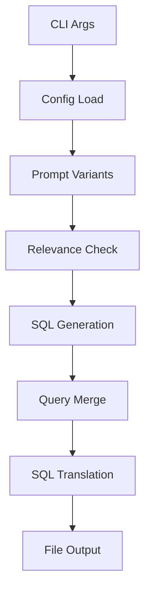
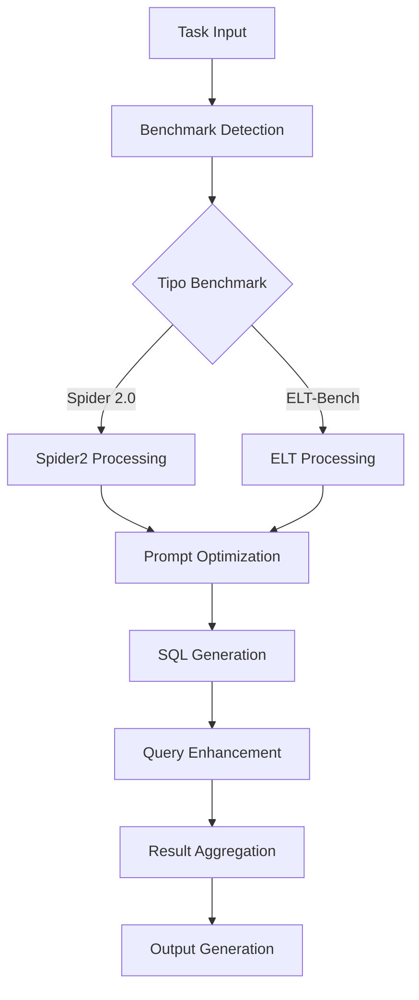
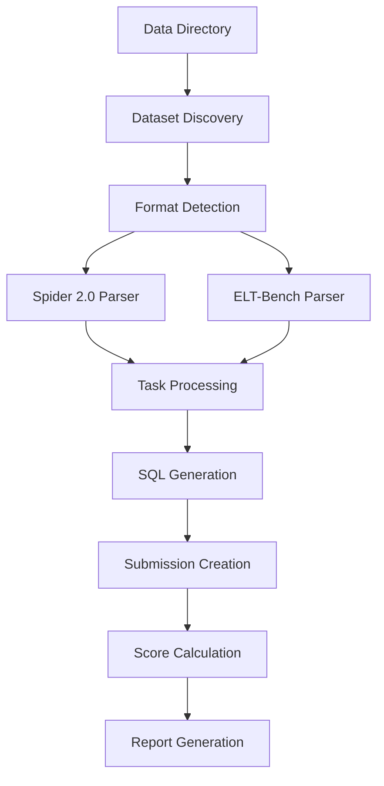
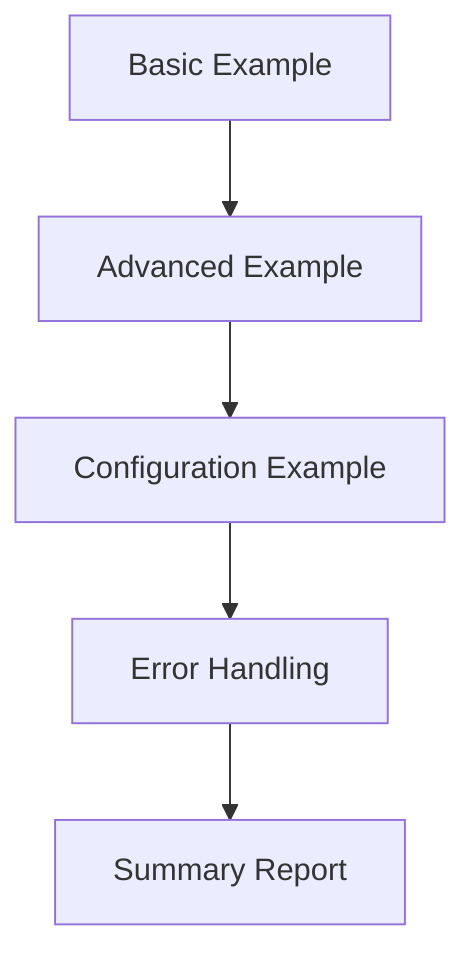
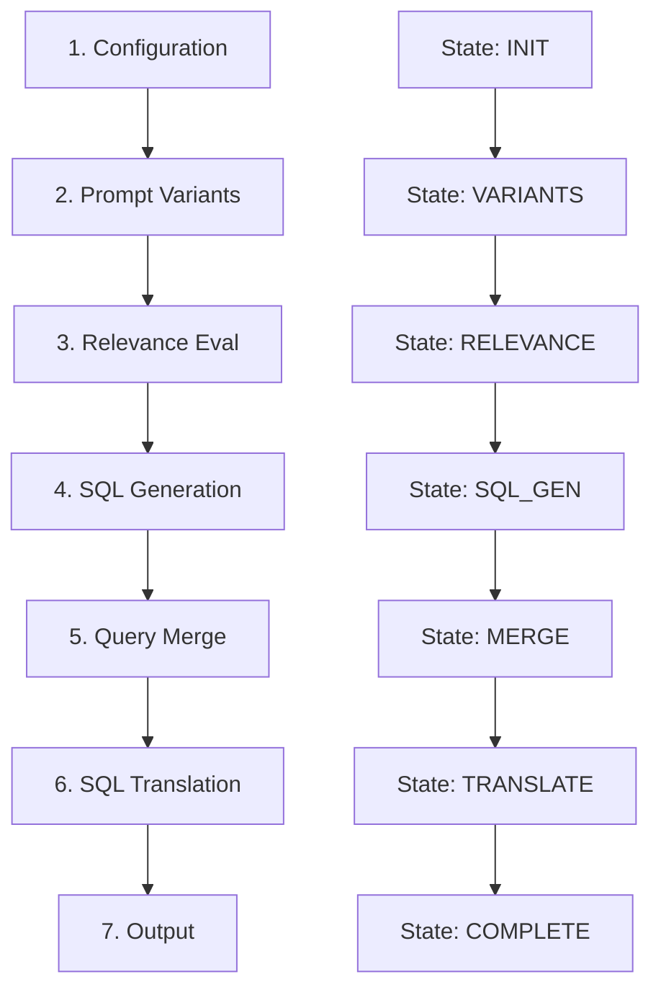
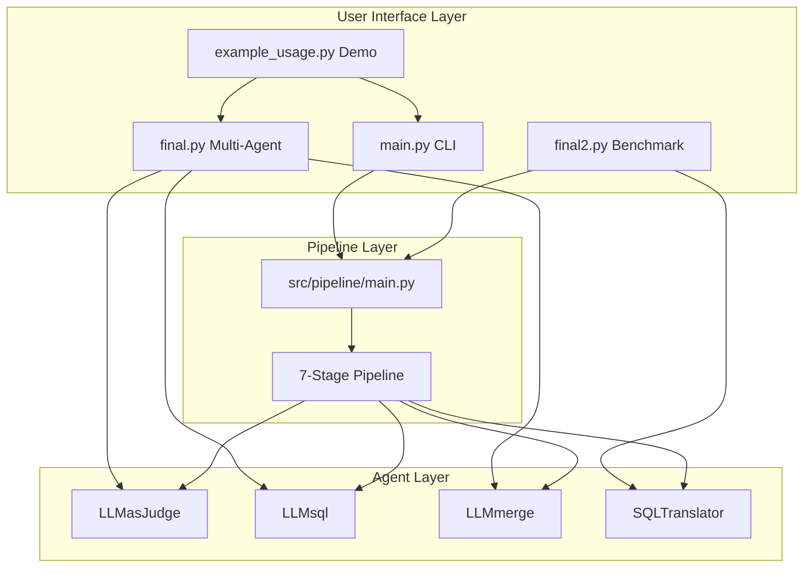

# 📖 NOVASQLAgent - Documentazione Tecnica Dettagliata

## 🎯 Panoramica del Sistema

NOVASQLAgent è un sistema multi-agente avanzato per la generazione automatica di query SQL, progettato per supportare i benchmark **Spider 2.0** e **ELT-Bench**. Il sistema implementa una pipeline a 7 stadi con orchestrazione di agenti specializzati per massimizzare la qualità e l'accuratezza della generazione SQL.

### 🏗️ Architettura del Sistema

```
┌─────────────────────────────────────────────────────────────────┐
│                     NOVASQLAgent System                        │
├─────────────────────────────────────────────────────────────────┤
│  CLI Interface Layer                                           │
│  ┌─────────────┐ ┌─────────────┐ ┌─────────────┐              │
│  │   main.py   │ │  final.py   │ │  final2.py  │              │
│  │ Simple CLI  │ │ Multi-Agent │ │ Benchmarks  │              │
│  └─────────────┘ └─────────────┘ └─────────────┘              │
├─────────────────────────────────────────────────────────────────┤
│  Pipeline Layer                                                │
│  ┌─────────────┐ ┌─────────────┐ ┌─────────────┐              │
│  │Configuration│ │Prompt Variant│ │ Relevance   │              │
│  │  Management │ │  Generation  │ │ Evaluation  │              │
│  └─────────────┘ └─────────────┘ └─────────────┘              │
│  ┌─────────────┐ ┌─────────────┐ ┌─────────────┐              │
│  │SQL Generation│ │Query Merge  │ │ Translation │              │
│  │             │ │             │ │ & Output    │              │
│  └─────────────┘ └─────────────┘ └─────────────┘              │
├─────────────────────────────────────────────────────────────────┤
│  Agent Layer                                                   │
│  ┌─────────────┐ ┌─────────────┐ ┌─────────────┐              │
│  │ LLMasJudge  │ │   LLMsql    │ │  LLMmerge   │              │
│  │Judge+Rewrite│ │SQL Generator│ │Query Merger │              │
│  └─────────────┘ └─────────────┘ └─────────────┘              │
│  ┌─────────────┐ ┌─────────────┐ ┌─────────────┐              │
│  │   LLMrag    │ │ AgentHF     │ │SQLTranslator│              │
│  │RAG System   │ │Code Execute │ │Multi-Dialect│              │
│  └─────────────┘ └─────────────┘ └─────────────┘              │
├─────────────────────────────────────────────────────────────────┤
│  Data Layer                                                    │
│  ┌─────────────┐ ┌─────────────┐ ┌─────────────┐              │
│  │Vector DB    │ │Benchmark    │ │Training     │              │
│  │(FAISS)      │ │Datasets     │ │Data         │              │
│  └─────────────┘ └─────────────┘ └─────────────┘              │
└─────────────────────────────────────────────────────────────────┘
```

---

## 📋 File Principali - Analisi Dettagliata

### 1. `/u/gpinna/phd_projects/NOVASQLAgent/NOVASQLAgent/main.py`

#### 🎯 **Scopo e Funzionalità**

`main.py` è l'interfaccia CLI principale per l'uso diretto del sistema. Implementa un workflow semplificato della pipeline completa, ottimizzato per utilizzo rapido e testing.

#### 🏗️ **Architettura Interna**

```python
def run_sql_generation_pipeline():
    """
    Pipeline a 7 stadi:
    1. Configuration management (semplificato)
    2. Generate prompt variants (LLMasJudge rewriter)
    3. Evaluate relevance (LLMasJudge judge)
    4. Generate SQL (LLMsql)
    5. Merge queries (LLMmerge)
    6. Translate SQL (SQLTranslator)
    7. Write output to file
    """
```

#### 🔧 **Componenti Chiave**

1. **Argument Parser**: Gestione parametri CLI completa
2. **Pipeline Orchestrator**: `run_sql_generation_pipeline()`
3. **Error Handling**: Gestione errori con fallback graceful
4. **Output Management**: Formattazione e scrittura file SQL

#### 📊 **Flusso di Esecuzione**



#### 🚀 **Come Lanciare**

```bash
# ═══════════════════════════════════════════════════════════════
# UTILIZZO BASE
# ═══════════════════════════════════════════════════════════════

# Generazione SQL semplice
python main.py --prompt "Find all users with age > 25" \
                --descriptions "users table contains id, name, age columns"

# Con output personalizzato
python main.py --prompt "Get total sales by region" \
                --descriptions "sales table" "regions table" \
                --output custom_query.sql

# ═══════════════════════════════════════════════════════════════
# CONFIGURAZIONE AVANZATA
# ═══════════════════════════════════════════════════════════════

# Con dialect SQL specifico
python main.py --prompt "Monthly revenue report" \
                --descriptions "orders table" "customers table" \
                --dialect postgresql \
                --verbose

# Configurazione ottimizzata
python main.py --prompt "Complex analytics query" \
                --descriptions "sales_data" "product_catalog" \
                --variants 5 \
                --confidence 0.8 \
                --dialect bigquery \
                --model microsoft/phi-4-mini-instruct

# ═══════════════════════════════════════════════════════════════
# TESTING E DEBUG
# ═══════════════════════════════════════════════════════════════

# Dry run per testing
python main.py --prompt "Test query" \
                --descriptions "test table" \
                --dry-run \
                --verbose

# Debug completo
python main.py --prompt "Debug query" \
                --descriptions "debug_table" \
                --verbose \
                --no-merge \
                --no-validate

# ═══════════════════════════════════════════════════════════════
# CASI D'USO SPECIFICI
# ═══════════════════════════════════════════════════════════════

# E-commerce Analytics
python main.py --prompt "Find top 10 customers by total orders last year" \
                --descriptions "customers table: id, name, email" \
                            "orders table: id, customer_id, total, date" \
                --dialect mysql \
                --output ecommerce_top_customers.sql

# Data Warehouse Query
python main.py --prompt "Monthly sales by product category with YoY growth" \
                --descriptions "fact_sales: product_id, amount, date" \
                            "dim_products: id, name, category" \
                --dialect snowflake \
                --variants 3 \
                --output dw_monthly_sales.sql

# IoT Data Analysis
python main.py --prompt "Average temperature by sensor location last 24h" \
                --descriptions "sensor_readings: sensor_id, temperature, timestamp" \
                            "sensors: id, location, type" \
                --dialect bigquery \
                --output iot_temperature_analysis.sql
```

#### 📂 **Output Generato**

```sql
-- ===================================================
-- Generated SQL Query
-- ===================================================
-- Generated at: 2024-01-15 14:30:25
-- Generated by: NOVASQLAgent Pipeline
-- Original prompt: Find all users with age > 25
-- Target dialect: postgresql
-- ===================================================

SELECT u.id, u.name, u.age 
FROM users u 
WHERE u.age > 25 
ORDER BY u.age DESC;
```

---

### 2. `/u/gpinna/phd_projects/NOVASQLAgent/NOVASQLAgent/final.py`

#### 🎯 **Scopo e Funzionalità**

`final.py` è il **coordinatore principale** del sistema multi-agente. Orchestratore completo che gestisce task complessi attraverso agenti specializzati, supporta benchmarks multipli e processing parallelo.

#### 🏗️ **Architettura Interna**

```python
class NOVAMultiAgentOrchestrator:
    """
    Orchestratore principale con:
    - Auto-detection benchmark type
    - Gestione agenti specializzati
    - Processing parallelo
    - Sistema di reporting avanzato
    """
    
    def __init__(self, config: MultiAgentConfig):
        self.agents = {
            'judge': LLMasJudgeSystem(),
            'sql_generator': SQLLLMGenerator(),
            'sql_merger': LLMSQLMergerSystem(),
            'sql_translator': SQLTranslator(),
            # 'rag': RAGAgent(),              # Non disponibile
            # 'planner': RequestPlanner(),    # Non disponibile
            # 'code_agent': CodeAgent(),      # Non disponibile
            'vector_db': VectorDBManager()
        }
```

#### 🔧 **Componenti Chiave**

1. **Multi-Agent Orchestrator**: Gestione coordinata di agenti multipli
2. **Benchmark Detection**: Auto-rilevamento tipo benchmark (Spider 2.0 vs ELT-Bench)
3. **Parallel Processing**: Esecuzione concorrente con semafori
4. **Task Management**: Gestione completa del ciclo di vita dei task
5. **Reporting System**: Generazione report dettagliati e statistiche

#### 📊 **Flusso di Esecuzione**



#### 🚀 **Come Lanciare**

```bash
# ═══════════════════════════════════════════════════════════════
# UTILIZZO BASE
# ═══════════════════════════════════════════════════════════════

# Esecuzione con task di esempio
python final.py --example-tasks --verbose

# Processing automatico benchmark
python final.py --benchmark auto --verbose

# ═══════════════════════════════════════════════════════════════
# CONFIGURAZIONE BENCHMARK SPECIFICI
# ═══════════════════════════════════════════════════════════════

# Spider 2.0 Lite con modello avanzato
python final.py --benchmark spider2-lite \
                --model gpt-4o \
                --output-dir ./spider_results \
                --verbose

# ELT-Bench processing
python final.py --benchmark elt-bench \
                --model microsoft/phi-4-mini-instruct \
                --max-agents 3 \
                --timeout 300

# ═══════════════════════════════════════════════════════════════
# PROCESSING PARALLELO AVANZATO
# ═══════════════════════════════════════════════════════════════

# Batch processing con file JSON
python final.py --input-file tasks.json \
                --parallel \
                --max-agents 5 \
                --output-dir ./batch_results

# Processing parallelo ottimizzato
python final.py --input-file large_dataset.json \
                --parallel \
                --max-agents 10 \
                --timeout 600 \
                --verbose

# ═══════════════════════════════════════════════════════════════
# CONFIGURAZIONE AGENTI AVANZATA
# ═══════════════════════════════════════════════════════════════

# Con tutti i componenti abilitati
python final.py --example-tasks \
                --model gpt-4o \
                --fallback-model microsoft/phi-4-mini-instruct \
                --parallel \
                --max-agents 8 \
                --debug

# Configurazione production
python final.py --input-file production_tasks.json \
                --model claude-3-5-sonnet-20241022 \
                --parallel \
                --max-agents 15 \
                --timeout 900 \
                --output-dir ./production_results \
                --verbose

# ═══════════════════════════════════════════════════════════════
# DEBUGGING E TESTING
# ═══════════════════════════════════════════════════════════════

# Debug mode completo
python final.py --example-tasks \
                --debug \
                --max-agents 1 \
                --verbose

# Test di performance
python final.py --benchmark spider2-lite \
                --max-agents 1 \
                --timeout 60 \
                --output-dir ./performance_test
```

#### 📋 **File Input Esempio (tasks.json)**

```json
{
  "tasks": [
    {
      "prompt": "Find customers who made purchases in the last 30 days",
      "descriptions": [
        "customers table: customer_id, name, email, registration_date",
        "orders table: order_id, customer_id, order_date, total_amount",
        "order_items table: item_id, order_id, product_id, quantity"
      ],
      "dialect": "postgresql"
    },
    {
      "instruction": "Create ELT pipeline for user analytics",
      "context": [
        "Source: CRM database (users, contacts)",
        "Target: Analytics warehouse with star schema",
        "Requirements: Data quality checks, incremental updates"
      ]
    }
  ]
}
```

#### 📊 **Output Report Esempio**

```json
{
  "summary": {
    "total_tasks": 10,
    "successful_tasks": 8,
    "failed_tasks": 2,
    "success_rate": 80.0,
    "avg_execution_time": 45.2
  },
  "benchmark_distribution": {
    "spider2-lite": 6,
    "elt-bench": 4
  },
  "agent_usage_statistics": {
    "sql_generator": 10,
    "judge": 10,
    "sql_merger": 7,
    "sql_translator": 5
  }
}
```

---

### 3. `/u/gpinna/phd_projects/NOVASQLAgent/NOVASQLAgent/final2.py`

#### 🎯 **Scopo e Funzionalità**

`final2.py` è il **processore di dataset reali** specializzato per benchmarks Spider 2.0 e ELT-Bench. Carica dataset autentici, genera submission files e produce valutazioni di performance.

#### 🏗️ **Architettura Interna**

```python
class RealBenchmarkProcessor:
    """
    Processore per dataset reali con:
    - Discovery automatico dataset
    - Caricamento format-specific
    - Generazione submission files
    - Scoring e valutazione
    """
    
    def discover_benchmark_data(self) -> List[BenchmarkTask]:
        # Spider 2.0 Lite: questions.jsonl
        # Spider 2.0 Snow: snowflake_queries.json  
        # Spider 2.0 DBT: dbt_tasks.json
        # ELT-Bench: tasks.json
```

#### 🔧 **Componenti Chiave**

1. **Dataset Discovery**: Auto-rilevamento e caricamento dataset
2. **Format Parsers**: Parser specifici per ogni tipo di benchmark
3. **Submission Generator**: Creazione file submission conformi
4. **Performance Evaluator**: Valutazione score e metriche
5. **Report Generator**: Report comparativi multi-benchmark

#### 📊 **Flusso di Elaborazione**



#### 🚀 **Come Lanciare**

```bash
# ═══════════════════════════════════════════════════════════════
# SETUP INIZIALE
# ═══════════════════════════════════════════════════════════════

# 1. Download dataset (prima esecuzione)
python src/data/raw_data_manager.py --dataset spider2 --output-dir ./data
python src/data/raw_data_manager.py --dataset elt-bench --output-dir ./data

# 2. Verifica struttura dataset
ls -la data/
# Expected:
# data/spider2-lite/questions.jsonl
# data/elt-bench/tasks.json

# ═══════════════════════════════════════════════════════════════
# PROCESSING COMPLETO
# ═══════════════════════════════════════════════════════════════

# Processing di tutti i benchmark disponibili
python final2.py --data-dir ./data \
                 --output-dir ./final2_results \
                 --verbose \
                 --max-concurrent 3

# Processing con report dettagliato
python final2.py --data-dir ./data \
                 --output-dir ./benchmark_evaluation \
                 --max-concurrent 5 \
                 --verbose

# ═══════════════════════════════════════════════════════════════
# BENCHMARK SPECIFICI
# ═══════════════════════════════════════════════════════════════

# Solo Spider 2.0 Lite
python final2.py --benchmark spider2-lite \
                 --max-concurrent 3 \
                 --limit 50 \
                 --verbose

# Solo ELT-Bench con debug
python final2.py --benchmark elt-bench \
                 --debug \
                 --max-concurrent 2 \
                 --limit 10

# Spider 2.0 Snowflake tasks
python final2.py --benchmark spider2-snow \
                 --max-concurrent 2 \
                 --verbose

# ═══════════════════════════════════════════════════════════════
# TESTING E SVILUPPO
# ═══════════════════════════════════════════════════════════════

# Test rapido (primi 5 task)
python final2.py --benchmark spider2-lite \
                 --limit 5 \
                 --verbose

# Test singolo task
python final2.py --benchmark spider2-lite \
                 --limit 1 \
                 --debug \
                 --max-concurrent 1

# Performance test
python final2.py --benchmark spider2-lite \
                 --limit 100 \
                 --max-concurrent 10 \
                 --output-dir ./performance_test

# ═══════════════════════════════════════════════════════════════
# PRODUCTION EVALUATION
# ═══════════════════════════════════════════════════════════════

# Evaluation completa Spider 2.0
python final2.py --benchmark spider2-lite \
                 --max-concurrent 8 \
                 --output-dir ./spider2_official_eval \
                 --verbose

# Evaluation completa ELT-Bench  
python final2.py --benchmark elt-bench \
                 --max-concurrent 5 \
                 --output-dir ./elt_bench_official_eval \
                 --verbose

# Evaluation comparativa completa
python final2.py --max-concurrent 6 \
                 --output-dir ./comparative_evaluation \
                 --verbose
```

#### 📁 **Struttura Dataset Richiesta**

```
data/
├── spider2-lite/
│   ├── questions.jsonl              # ✅ Required
│   └── databases/                   # 📁 Schema info
│       ├── db1/
│       └── db2/
├── spider2-snow/
│   ├── snowflake_queries.json       # ✅ Required
│   └── schemas/                     # 📁 Snowflake schemas
├── spider2-dbt/
│   ├── dbt_tasks.json              # ✅ Required
│   └── models/                     # 📁 DBT models
└── elt-bench/
    ├── tasks.json                  # ✅ Required
    └── data_streams/               # 📁 Example data
```

#### 📊 **Output Submission Files**

```
final2_results/
├── spider2-lite/
│   ├── spider2_lite_001.sql              # SQL submission
│   ├── spider2_lite_001_result.json      # Detailed result
│   ├── spider2_lite_002.sql
│   └── ...
├── elt-bench/
│   ├── elt_bench_001_submission.json     # ELT submission
│   ├── elt_bench_001_result.json         # Detailed result
│   └── ...
└── benchmark_report.json                 # Comprehensive report
```

#### 📈 **Report di Performance**

```json
{
  "summary": {
    "total_tasks": 500,
    "successful_tasks": 425,
    "failed_tasks": 75,
    "overall_success_rate": 85.0,
    "total_processing_time": 3600.5
  },
  "benchmark_statistics": {
    "spider2-lite": {
      "total": 300,
      "successful": 255,
      "success_rate": 85.0,
      "avg_score": 0.78,
      "avg_execution_time": 25.4
    },
    "elt-bench": {
      "total": 200,
      "successful": 170,
      "success_rate": 85.0,
      "avg_score": 0.72,
      "avg_execution_time": 35.2
    }
  },
  "error_analysis": {
    "total_errors": 75,
    "common_errors": [
      ["Syntax error in generated SQL", 25],
      ["Table not found in schema", 15],
      ["Complex join not handled", 12]
    ]
  }
}
```

---

### 4. `/u/gpinna/phd_projects/NOVASQLAgent/NOVASQLAgent/example_usage.py`

#### 🎯 **Scopo e Funzionalità**

`example_usage.py` è un **tutorial interattivo** che dimostra progressivamente tutte le funzionalità del sistema. Contiene esempi graduali per apprendimento e testing completo.

#### 🏗️ **Architettura Interna**

```python
# 4 Esempi Progressivi:
def basic_example():          # Workflow semplice
def advanced_example():       # Pipeline completa 
def configuration_example():  # Gestione configurazione
def error_handling_example(): # Gestione errori
```

#### 🔧 **Componenti Dimostrati**

1. **Basic Example**: Workflow semplificato con componenti essenziali
2. **Advanced Example**: Pipeline completa con tutti i componenti
3. **Configuration Example**: Gestione file di configurazione
4. **Error Handling**: Dimostrazione gestione errori e recovery

#### 📊 **Flusso Dimostrativo**



#### 🚀 **Come Lanciare**

```bash
# ═══════════════════════════════════════════════════════════════
# ESECUZIONE COMPLETA
# ═══════════════════════════════════════════════════════════════

# Tutti gli esempi in sequenza
python example_usage.py

# Output atteso:
# 🚀 Basic SQL Generation Example
# 🔧 Advanced SQL Generation Pipeline Example  
# ⚙️ Configuration Settings Example
# 🚨 Error Handling Example
# 🎉 All examples completed!

# ═══════════════════════════════════════════════════════════════
# ESEMPI SINGOLI
# ═══════════════════════════════════════════════════════════════

# Solo esempio base
python -c "from example_usage import basic_example; basic_example()"

# Solo esempio avanzato
python -c "from example_usage import advanced_example; advanced_example()"

# Solo configurazione
python -c "from example_usage import configuration_example; configuration_example()"

# Solo error handling
python -c "from example_usage import error_handling_example; error_handling_example()"

# ═══════════════════════════════════════════════════════════════
# TESTING E DEBUGGING
# ═══════════════════════════════════════════════════════════════

# Test con debugging Python
python -i example_usage.py
>>> # Ora puoi eseguire le funzioni interattivamente
>>> basic_example()
>>> advanced_example()

# Test componenti specifici
python -c "
from example_usage import *
from src.model.LLMasJudge import LLMasJudgeSystem
judge = LLMasJudgeSystem()
print('Judge system loaded successfully')
"
```

#### 📁 **File Generati**

```
./output/
├── basic_example.sql                    # Esempio base
└── advanced/
    ├── advanced_example_20240115_143025.sql  # Esempio avanzato
    └── metadata_20240115_143025.json         # Metadata esecuzione

./config/
└── example_config.json                 # Configurazione esempio
```

#### 📋 **Contenuto Example Config**

```json
{
  "pipeline_name": "E-commerce Analytics Pipeline",
  "model": "microsoft/phi-4-mini-instruct",
  "dialect": "bigquery", 
  "variants": 4,
  "confidence": 0.75,
  "include_comments": true,
  "max_length": 2500
}
```

---

### 5. `/u/gpinna/phd_projects/NOVASQLAgent/NOVASQLAgent/src/pipeline/main.py`

#### 🎯 **Scopo e Funzionalità**

`src/pipeline/main.py` è il **core della pipeline a 7 stadi**, implementa il sistema modulare di elaborazione con agenti specializzati e gestione stato completa.

#### 🏗️ **Architettura Interna**

```python
class SQLGenerationPipeline:
    """
    Pipeline a 7 stadi:
    1. Configuration management
    2. Prompt variant generation  
    3. Relevance evaluation
    4. SQL generation
    5. Query merging
    6. SQL translation
    7. Output generation
    """
    
    def __init__(self, config: PipelineConfig):
        self.agents = {
            "configuration": ConfigurationAgent(),
            "prompt_variant": PromptVariantAgent(),
            "relevance_evaluation": RelevanceEvaluationAgent(),
            "sql_generation": SQLGenerationAgent(),
            "query_merge": QueryMergeAgent(),
            "translation": TranslationAgent(),
            "output": OutputAgent()
        }
```

#### 🔧 **Componenti Chiave**

1. **Pipeline State Management**: Gestione stato completa con tracking
2. **Agent Orchestration**: Coordinamento agenti specializzati
3. **Error Recovery**: Sistema di recovery per ogni stadio
4. **Metadata Tracking**: Raccolta metriche dettagliate
5. **Result Aggregation**: Aggregazione risultati multi-stadio

#### 📊 **Workflow dei 7 Stadi**



#### 🚀 **Come Utilizzare (Programmaticanente)**

```python
# ═══════════════════════════════════════════════════════════════
# UTILIZZO DIRETTO
# ═══════════════════════════════════════════════════════════════

from src.pipeline.main import SQLGenerationPipeline
from src.pipeline.models.pipeline_config import PipelineConfig

# Configurazione pipeline
config = PipelineConfig(
    pipeline_name="Advanced SQL Pipeline",
    sql_generation=SQLGenerationConfig(
        model_name="microsoft/phi-4-mini-instruct",
        max_new_tokens=512
    )
)

# Inizializzazione pipeline
pipeline = SQLGenerationPipeline(config)

# Esecuzione pipeline
result = pipeline.run(
    external_prompt="Find top customers by revenue",
    external_descriptions=[
        "customers table: id, name, email",
        "orders table: id, customer_id, amount, date"
    ],
    output_file="top_customers.sql"
)

# Verifica risultato
if result.success:
    print(f"SQL generated: {result.final_sql}")
    print(f"Execution time: {result.duration_seconds:.2f}s")
else:
    print(f"Pipeline failed: {result.errors}")

# ═══════════════════════════════════════════════════════════════
# CONFIGURAZIONE AVANZATA
# ═══════════════════════════════════════════════════════════════

# Pipeline con configurazione completa
config = PipelineConfig(
    pipeline_name="Production Pipeline",
    
    # Configurazione SQL Generation
    sql_generation=SQLGenerationConfig(
        model_name="microsoft/phi-4-mini-instruct",
        max_new_tokens=1024,
        temperature=0.1
    ),
    
    # Configurazione Translation
    translation=TranslationConfig(
        target_dialect="postgresql",
        enable_optimization=True
    ),
    
    # Configurazione Output
    output=OutputConfig(
        output_file="generated_query.sql",
        include_metadata=True,
        create_backup=True
    )
)

pipeline = SQLGenerationPipeline(config)

# Esecuzione con override configurazione
result = pipeline.run(
    external_prompt="Complex analytics query",
    external_descriptions=[
        "fact_sales: product_id, amount, date",
        "dim_products: id, name, category",
        "dim_time: date, month, quarter, year"
    ],
    config_overrides={
        "sql_generation": {
            "max_new_tokens": 2048
        }
    }
)

# ═══════════════════════════════════════════════════════════════
# DEBUGGING E MONITORING
# ═══════════════════════════════════════════════════════════════

# Pipeline con logging dettagliato
import logging
logging.basicConfig(level=logging.DEBUG)

pipeline = SQLGenerationPipeline(config)

# Monitoring stato pipeline
result = pipeline.run(
    external_prompt="Debug query",
    external_descriptions=["debug_table"]
)

# Analisi esecuzione
execution_log = pipeline.get_execution_log()
agent_info = pipeline.get_agent_info()

print("Execution Log:")
for entry in execution_log:
    print(f"{entry['timestamp']}: {entry['message']}")

print("\nAgent Information:")
for agent_name, info in agent_info.items():
    print(f"{agent_name}: {info['execution_count']} executions")

# ═══════════════════════════════════════════════════════════════
# BATCH PROCESSING
# ═══════════════════════════════════════════════════════════════

# Processing multipli task
tasks = [
    {
        "prompt": "Find recent orders",
        "descriptions": ["orders table", "customers table"]
    },
    {
        "prompt": "Calculate monthly revenue",  
        "descriptions": ["sales table", "products table"]
    }
]

results = []
for i, task in enumerate(tasks):
    result = pipeline.run(
        external_prompt=task["prompt"],
        external_descriptions=task["descriptions"],
        output_file=f"query_{i+1}.sql"
    )
    results.append(result)

# Analisi batch results
successful = sum(1 for r in results if r.success)
print(f"Batch completed: {successful}/{len(results)} successful")
```

#### 📊 **Struttura Result Object**

```python
class PipelineResult:
    pipeline_id: str                    # Unique identifier
    pipeline_name: str                  # Pipeline name
    execution_time: datetime            # Start time
    duration_seconds: float             # Total duration
    success: bool                       # Overall success
    final_sql: Optional[str]            # Generated SQL
    step_results: Dict[str, StepResult] # Results per step
    errors: List[Dict[str, str]]        # Error details
    metadata: Dict[str, Any]            # Execution metadata
```

#### 📈 **Metriche di Performance**

```json
{
  "pipeline_metrics": {
    "total_duration": 45.2,
    "step_durations": {
      "configuration": 0.5,
      "prompt_variant": 8.2,
      "relevance_evaluation": 12.1,
      "sql_generation": 18.5,
      "query_merge": 3.2,
      "translation": 2.1,
      "output": 0.6
    },
    "success_rate": 95.0,
    "agents_used": 7,
    "memory_usage": "124MB"
  }
}
```

---

## 🔄 Integrazione tra i Componenti

### 📊 **Workflow Completo**



### 🎯 **Scenari d'Uso Raccomandati**

| Scenario | File Raccomandato | Configurazione |
|----------|-------------------|----------------|
| **Quick SQL Generation** | `main.py` | Single prompt + descriptions |
| **Complex Multi-Agent Tasks** | `final.py` | Batch processing + parallel |
| **Benchmark Evaluation** | `final2.py` | Real datasets + scoring |
| **Learning & Testing** | `example_usage.py` | Progressive examples |
| **Custom Pipeline Development** | `src/pipeline/main.py` | Programmatic integration |

### 📈 **Performance Guidelines**

- **Single Query**: `main.py` (< 30s)
- **Batch < 10 tasks**: `final.py` (< 5 min)
- **Batch 10-100 tasks**: `final.py --parallel` (< 30 min)  
- **Benchmark Evaluation**: `final2.py` (1-4 hours)
- **Development/Testing**: `example_usage.py` (< 2 min)

---

## 🛠️ Troubleshooting Comune

### ❌ **Problemi Frequenti**

1. **Import Errors**: 
   ```bash
   # Verifica PYTHONPATH
   export PYTHONPATH=/u/gpinna/phd_projects/NOVASQLAgent/NOVASQLAgent:$PYTHONPATH
   ```

2. **Transformers Compatibility**:
   ```bash
   # Downgrade a versione compatibile
   pip install transformers==4.35.2
   ```

3. **Missing Dependencies**:
   ```bash
   # Install complete requirements
   pip install sqlglot faiss-cpu sentence-transformers
   ```

4. **CUDA Issues**:
   ```bash
   # Force CPU usage
   export CUDA_VISIBLE_DEVICES=""
   ```

### ✅ **Verifiche Sistema**

```bash
# Test base components
python -c "from src.model.LLMasJudge import LLMasJudgeSystem; print('✅ LLMasJudge OK')"
python -c "from src.SQLTranlator.sql_translator import SQLTranslator; print('✅ SQLTranslator OK')"
python -c "import sqlglot; print('✅ SQLGlot OK')"
python -c "import faiss; print('✅ FAISS OK')"

# Test pipeline
python main.py --dry-run --prompt "test" --descriptions "test"

# Test full system
python example_usage.py
```

Questa documentazione fornisce una guida completa per l'utilizzo di tutti i componenti del sistema NOVASQLAgent, dalla semplice generazione SQL single-shot fino alla valutazione completa su benchmark reali.